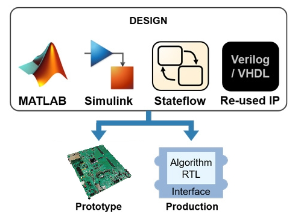
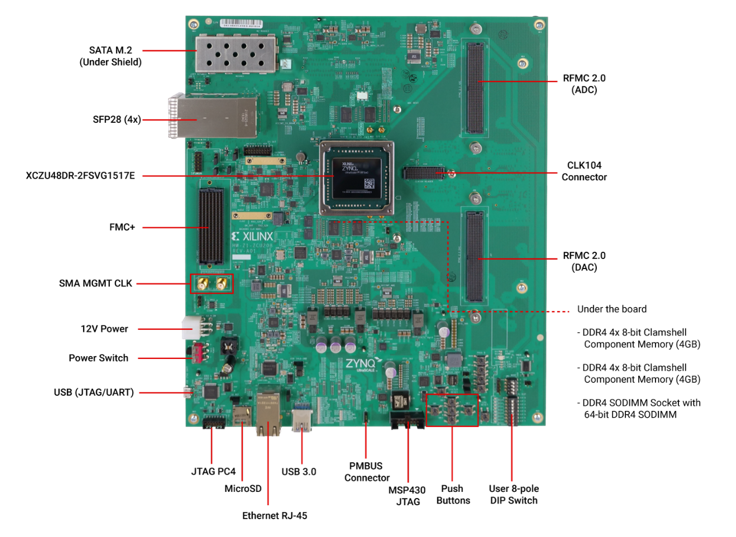

*************
Introducing Avnet HDL Coder Tools for Xilinx RFSoC Boards
*************

These instructions detail setup and usage of MathWorks HDL Coder tools for the following boards:

* :doc:`Xilinx ZCU208 devlopment board featuring the RFSoC Gen 3 ZU48DR device <./zcu208>` 

**Coming soon:**

* Avnet XRF8 SoM featuring the Xilinx RFSoC Gen 3 ZU47/48DR
* Avnet mmwWave kit (Xilinx ZCU208 + Otava DTRX2 mmWave add on card)

.. note:: Click links above to access the documentation
.. note:: Learn more about MathWorks HDL Coder tools: `here <https://www.mathworks.com/products/hdl-coder.html>`_
.. note:: Learn more about Xilinx RFSoC devices: `here <https://www.xilinx.com/rfsoc>`_
