*************************
Getting started with HDL Coder for the Xilinx ZCU208 RFSoC Gen 3 development board
*************************

-------------------
Required hardware
-------------------
* A PC with at least 16GB of RAM and 100GB of free hard disk space
* Xilinx ZCU208 RFSoC Gen 3 development board kit with production silicon (ES1 silicon not supported)
* A second 4GB or larger micro SD card (if you do not want to reuse the first)

-------------------
Required software
-------------------
* Windows 10 or a Linux version that is compatible with both Xilinx Vivado and MATLAB & Simulink
* Xilinx Vivado v2020.2 and a license for the RFSoC Gen 3 ZU48DR device
* MATLAB version R2021a & R2021b, including the following add-ons:
    * Simulink
    * Fixed Point Designer Toolbox
    * HDL Coder
    * MATLAB Coder
    * DSP System Toolbox is optional but most of the included examples use it
* Avnet RFSoC Explorer v2.0.2 or newer (may be obtained from MathWorks free File Exchange)
    * You MAY have to also install some other toolboxes that RFSoC Explorer requires
    * Communications Toolbox & Signal Processing Toolbox, see Explorer's docs for more info
* HDL Coder Support Package for Xilinx RFSoC Devices (July 14th, 2021 or newer)
* HDL Coder Support Package for Zynq (April, 2021 or newer)
* Avnet HDL Coder for ZCU208 with examples zip file (read instructions below for more information)

For R2021a:

* If the Embedded Coder Toolbox is not installed you will need to also install the Embedded Coder Support Package for Xilinx Zynq Platform

For R2021b:

* You do not have to install the Embedded Coder Support Package.  You may see a warning when using HDL Workflow Advisor, which you may ignore

For R2022a or newer:

* You may see a warning when trying to execute HDL Workflow Advisor with the included zcu208 examples
* This is benign, Mathworks changed some of the SLX fle variables that don't directly effect the examples
* You should be able to re-save the older example models in the newer Matlab releases and the error will go away completely
* You can also ignore the error and then proceed through the steps in HDL Workflow Advisor
* This could be mitigated by creating seperate example files for each release of Matlab.  However as long as the issues are not truly breaking anything, it is preferable to continue to have just one set of examples
* Here is an example of the warning you may see:

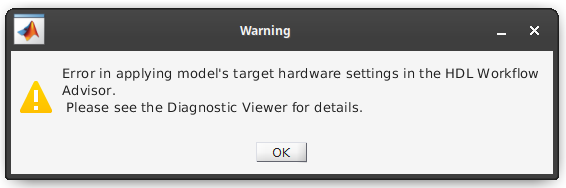

------------------
Installation instructions
------------------
   
~~~~~~~~~~~~~~~~~~
Step  1 - Install MATLAB and the extra tools
~~~~~~~~~~~~~~~~~~
Obtain and install MATLAB 2021a with all of the add-ons listed below.

.. note::
  Don't forget to activate your MATLAB license when prompted.

.. note::
  When installing the add-on and support packages you should use the latest versions that go along with MATLAB 2021a.

Required MathWorks licensed software:
  * MATLAB & Simulink 2021a
  * Fixed Point Designer Toolbox
  * HDL Coder
  * MATLAB Coder
  * DSP System Toolbox is optional but most of the included examples make use of it

Required MathWorks and 3rd party free software:
  * HDL Coder Support Package for Xilinx RFSoC Devices (July 14th, 2021 or newer)
  * HDL Coder Support Package for Zynq (April, 2021 or newer)
  * **(R2021a Only) If the Embedded Coder Toolbox is not already installed** you will need to also install the Embedded Coder Support Package for Xilinx Zynq Platform

.. warning::
  There is a bug in the Vivado tools that prevents certain features from working after the year 2022 began.  You MUST install a patch from MathWorks to use HDL Coder.
  Download the patch here, you must login to access the materials: https://www.mathworks.com/support/bugreports/2656440

Use the Add-On Manager from within MATLAB:

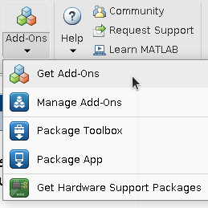

Use the Add-On Manager to search for and install all of these.
This is how they appear in Add-on Manager:

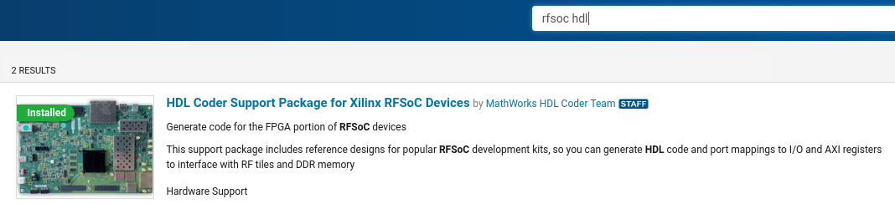

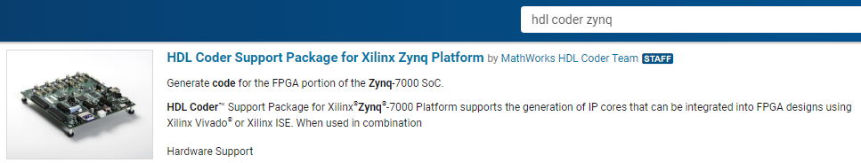

**For R2021a only:**

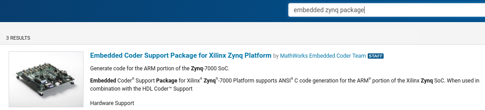

~~~~~~~~~~~~~~~~~~
Step  2 - Install Avnet RFSoC Explorer 2.0.1 or newer
~~~~~~~~~~~~~~~~~~

.. warning::
  **There is a bug in the MathWorks installer which caused v2.0.1 to add invalid support package paths.**
  v2.0.2 or newer of Avnet RFSoC Explorer will automatically correct the issue.  Please
  uninstall earlier versions if you have previously installed it and reinstall the latest.  See this 
  forum post to manually correct the problem until then: https://community.element14.com/products/devtools/avnetboardscommunity/avnetboard-forums/f/general/50102/mimo-signal-transmission-using-zcu208

From within MATLAB, once again open the Add-on explorer.
And search for 'Avnet RFSoC Explorer', then install it:

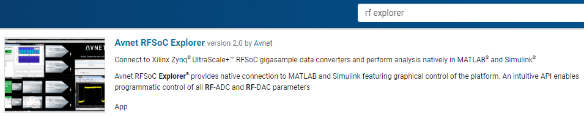

.. note::
  **Again, please make sure you are installing version 2.0.1 of RFSoC Explorer or newer once it becomes available.**

.. note::
  While completing the RF Explorer setup for the ZCU208, make note of the networking IP setup and address that was used to setup RF Explorer.  This will be used later to also setup HDL Coder for ZCU208.

.. warning::
  **For the RF Explorer instructions below, complete the System Setup** section all the way through the **Start RF Explorer** sub-section, then return to these instructions.
  The rest of the RF Explorer instructions require a mmWave DTRX2 add-on board intended for now for a different application.

Complete setting up RF Explorer for the ZCU208 by executing the following instructions,
then return here to complete the rest of the HDL Coder setup instructions:

* `Click to open instructions for setting up RF Explorer <https://rfsoc-mmw.readthedocs.io>`_

.. warning::
  Make sure you can run RF Explorer and communicate with the ZCU208 successfully before proceeding!

~~~~~~~~~~~~~~~~~~
Step  3 - Setup the ZCU208 board hardware with the XM655 RF breakout card
~~~~~~~~~~~~~~~~~~
Completing the steps to install and use Avnet RFSoC Explorer will ensure the ZCU208 networking is also almost correctly setup for use with HDL Coder.
If you want to run the included examples and collect live data, the **XM655 RF breakout board must also be attached to the ZCU208**.
See the Xilinx ZCU208 user and setup guide that came with your kit for how to do this.

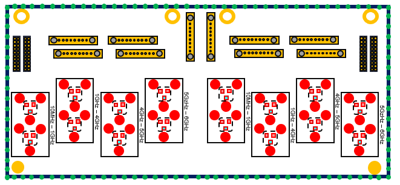

* `Click for more information about the XM655 RF breakout balun board <https://xilinx-wiki.atlassian.net/wiki/spaces/A/pages/769228974/XM650+XM655+and+CLK104+Add-On+Cards+Hardware+Description>`_ 

~~~~~~~~~~~~~~~~~~
Step  4 - Obtain the Avnet HDL Coder for ZCU208 SD card with examples zip file
~~~~~~~~~~~~~~~~~~
.. warning::
  The SD card contents have been compiled for production silicon only.  Running production bitstreams/binaries on ES1 silicon
  may cause permanent damage!  Before downloading the SD image please verify that your ZCU208 development board has a production ZU48DR part.
  
* `Click to download the Avnet HDL Coder for ZCU208 zip file <https://github.com/AvnetDev/hdlcoder-zcu208-zip/releases/download/v1.03/zcu208-hdlcoder.zip>`_

~~~~~~~~~~~~~~~~~~~~~~~~
Step 5 - Prepare the contents of the ZCU208 micro SD card
~~~~~~~~~~~~~~~~~~~~~~~~

Extract the prior Step's downloaded zip file contents and retain all the sub-folders of the ZCU208 HDL Coder zip file.
Extract the contents into **any appropriate local directory on your PC, where exactly is not important**.

In the MATLAB command window change into the directory where you just extracted the contents:

.. code-block:: matlab

  cd 'to the zip file contents directory'

Next, enter and execute the installation script:

.. code-block:: matlab

  installhdl208

After the installation script completes, a **file named interfaces** should open automatically in the MATLAB text editor.

~~~~~~~~~~~~~~~~~~~~~~~~~~~
Step 6 - Modify the ZCU208 network settings file
~~~~~~~~~~~~~~~~~~~~~~~~~~~
.. note::
  This is where you will use the IP address of the ZCU208 that you recorded while installing RF Explorer.

.. note::
  In the prior step, the interfaces file should be open in the MATLAB text editor.

.. warning::
  The interfaces file is setup to default to DHCP, you will only need to modify it if you need to set a static IP.

**If you directly connected the ZCU208 Ethernet to your PC or need a static IP** when setting up RF Explorer, for HDL Coder for ZCU208
you will need to make sure the following lines are commented out and your static IP is setup correctly.  For example, this sets up to
use a static IP address of 192.168.1.101:

.. code-block:: console

  # Always use these lines for both static and DHCP setups
  auto lo eth0
  iface lo inet loopback

  # To setup a static IP address uncomment the following 4 lines
  iface eth0 inet static
  address 192.168.1.101
  netmask 255.255.255.0
  gateway 192.168.1.1

  # For DHCP leave this line uncommented, if using a static IP comment it out.
  #iface eth0 inet dhcp

.. note::
  Make sure you save this text file locally and close it out of the editor.

~~~~~~~~~~~~~~~~~~~
Step  7 - Format a micro SD card
~~~~~~~~~~~~~~~~~~~
Obtain a 4GB or larger micro SD card, one should have been included with the ZCU208 kit.  You may want to obtain a second card if you want to 
retain the Avnet RFSoC Explorer SD card that you setup prior.  Sandisk or Delkin SD cards are highly recommended but other brands may also work.

First, use Windows or a Linux utility to format the SD card for the FAT32 format.  You only need 1 FAT32 partition on the SD card.

.. note::
  On a Windows system you can do this using File Explorer, as shown below.
  Right click the drive letter (F: in this example) for the micro SD card to access the format menu.

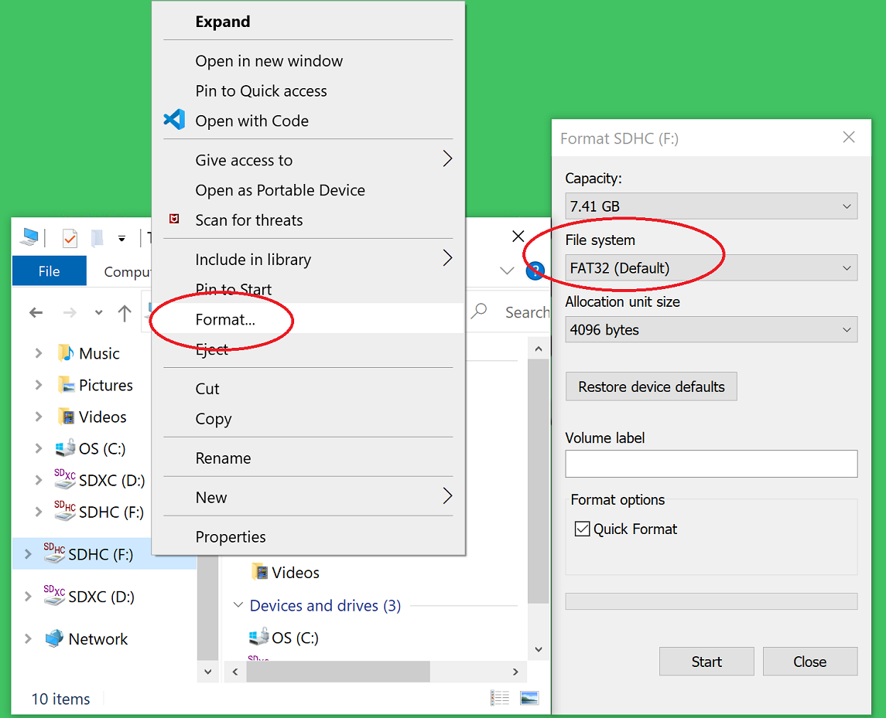

For how to do this for Linux, search the internet.  On a recent version of Ubuntu, you can either use dd or the gparted or gnome-disks utilities.

~~~~~~~~~~~~~~~~~~~~~~~~
Step 8 - Copy the files from the local folder to the micro SD card
~~~~~~~~~~~~~~~~~~~~~~~~
Next, from where you exracted the zip file copy all the files and sub-folders **under the ./sdcard folder** onto the newly formatted micro SD card.

.. note::
  Do not copy the 'sdcard' folder itself into the SD card, only the contents of 'sdcard', including all the sub-folders.

.. note::
  **Make sure the 'interfaces' text file version that you edited with your network settings is on the SD card.**

Here are some examples of how to do this using Window's File Explorer.

Drag and drop the contents of the .\sdcard folder onto the FAT32 formatted micro SD card (E: in this example):

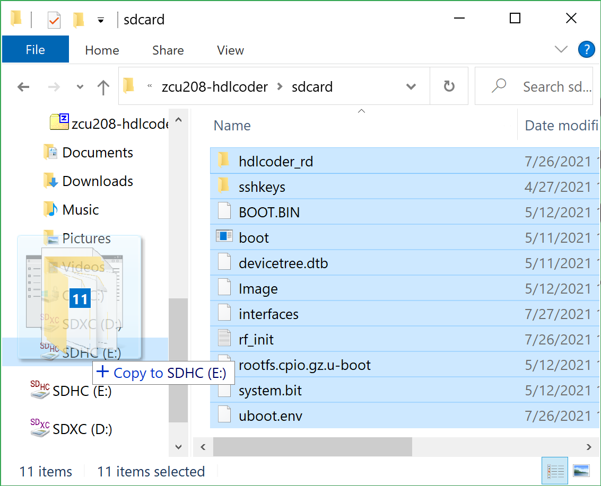

The file copy progess dialog:

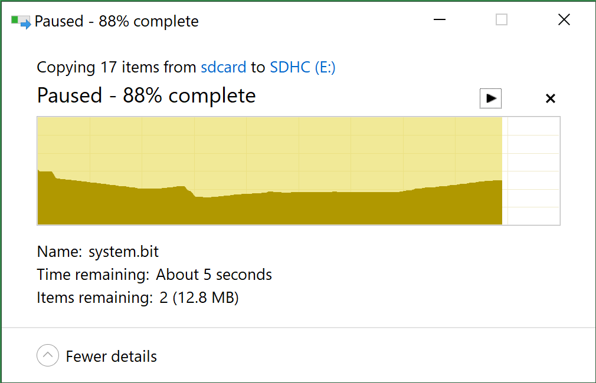

The files should now be on the micro SD card:

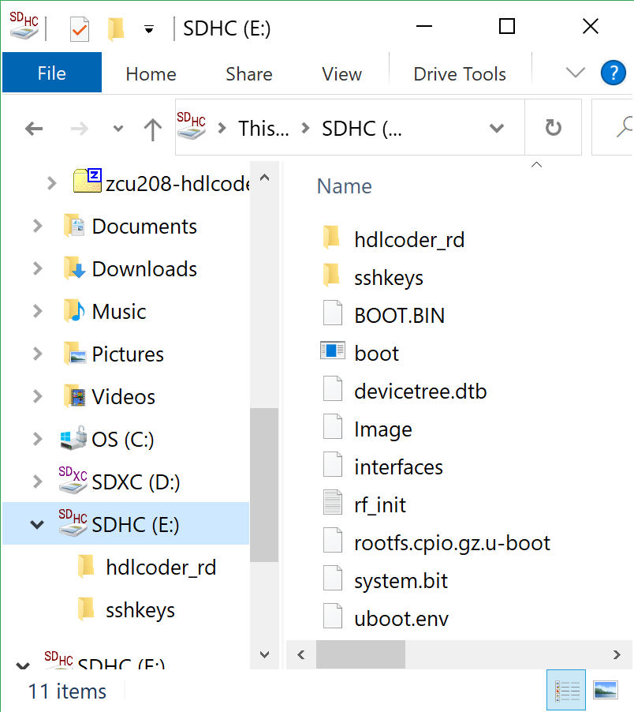

Finally, in a powered off ZCU208 board insert the SD card into the ZCU208 and then apply power.
Wait a little while for the software to complete the boot process.  Usually this takes about 15-30 seconds.

.. note::
  You can always check to see if the ZCU208 is ready by issuing a ping command from the connected PC.
  Issue: 'ping xxx.xxx.xxx.xxx' where xxx.xxx.xxx.xxx is the IP address you used when setting up RF Explorer.
  If the ping command fails and networking is not functioning correctly, re-check the interfaces file settings and your LAN, PC or ethernet cable.

~~~~~~~~~~~~~~~~~~~~
Step  9 - Completing the network setup with MATLAB for HDL Coder for ZCU208
~~~~~~~~~~~~~~~~~~~~
To setup and test the network connection of the ZCU208, use the MATLAB command window to issue the following commands.
Insert the ZCU208 IP address that was utilized for the RFSoC Explorer installation,
insert your IP address in the format of xxx.xxx.xxx.xxx between the single quotes:

.. code-block:: matlab

  zcu = zynqrfsocnetwork
  zcu.IPAddress = 'your ZCU208 IP Address xxx.xxx.xxx.xxx goes here'

Check the connection by entering the following command:

.. code-block:: matlab

  zcu.checkConnection

It should report: 'Connection successful'

~~~~~~~~~~~~~~~~~~~~~~~~
Step 10 - Run the included ADC Capture demo
~~~~~~~~~~~~~~~~~~~~~~~~
On your PC, whereever you extracted the .zip file, there will be a folder named 'examples'.
From within MATLAB's command window or using MATLAB's file explorer gui, **change the directory into the folder examples/ADCDataCapture**

Next, to briefly explore the Simulink design, from the MATLAB file explorer, **double click** the .slx file.

.. image:: ./images_zcu208/opensim.png

After pausing a little while (it might take a long little while) this will open a Simulink design and show the top-level.
You may further explore this design in Simulink by double clicking into the sub-blocks.  You may also run the simulation by clicking on the run button.

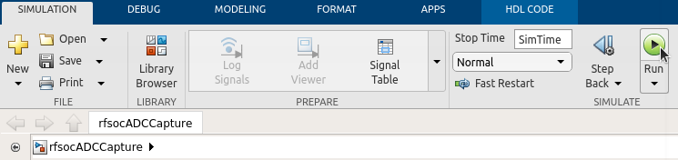

After you have finished exploring, close the Simulink design and **return to the MATLAB command window**.

This example outputs a CW tone from the ZU48DR Tile 0 DAC 0 and expects it to input on Tile 0 ADC 0.  You must manually wire the signals if you want to capture valid data.
This can be wired using the kit's short RF SMA cables, the Carlisle 8 cables and the XM655 balun board using the 10MHz to 1GHz baluns.

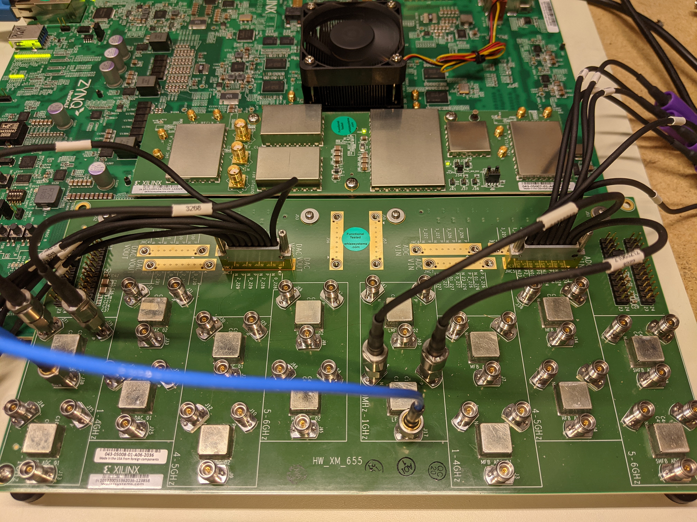

.. note::
  If you choose not to install the RF cables and XM655 you can still run the demo.  However the collected data will just contain residual noise.

After the RF signals are correctly wired, to run the demo go back to the MATLAB command window and enter the following command:

.. code-block:: matlab

  adcdemo

After starting up the demo by executing adcdemo.m, this example will capture live samples from the ZCU208 Tile 0 ADC 0 into MATLAB.  The data will be displayed on various plots, you may stop collecting samples by closing the time sample plot window.  You can also inspect and use the MATLAB variables that contain the samples.

.. note::
  This example's FPGA (PL) bitstream was pre-loaded onto the SD card.  It does not require rebuilding the FPGA design.  Subsequent examples however will.

~~~~~~~~~~~~~~~~~~
Step  11 - Install Vivado 2020.2
~~~~~~~~~~~~~~~~~~
If you want to customize the design or re-create the FPGA (PL) bitstreams you must download and install Xilinx Vivado version 2020.2 (must be v2020.2).

.. warning::
  Also obtain and install a license for the RFSoC Gen 3 devices or at least the production ZU48DR part.

.. note::
  A node-locked license for the RFSoC Gen 3 ZU28DR device is included with the ZCU208 kit.

.. note::
  Vitis is not required or used but you may install it also if you like.

~~~~~~~~~~~~~~~~~~~~~~~~~~~
Step 12 - Completing the HDL Coder Vivado setup
~~~~~~~~~~~~~~~~~~~~~~~~~~~
This step is nescessary for rebuilding the HDL Coder designs from within MATLAB.

Locate on your Windows or Linux PC the path where Vivado 2020.2 was installed. **You will need to locate the 'bin' directory**.

On Linux it is often installed under '/tools/Xilinx/Vivado/2020.2/bin'

On Windows it is often installed under 'C:\\tools\\Xilinx\\Vivado\\2020.2\\bin'.

We must then tell MATLAB where to find Vivado on your PC.
This is done by entering the following command in the MATLAB command
window **(after you edit the string for your own Vivado location)**:

.. code-block:: console

  hdlsetuptoolpath('ToolName','Xilinx Vivado','ToolPath','your install path including the ./bin folder goes here')

If successful on a Windows platform you should see the following in the MATLAB command window (your own path setting may be different):

.. code-block:: console

  Prepending following Xilinx Vivado path(s) to the system path:
  C:\\Xilinx\\Vivado\\2020.2\\bin

.. note::
  The Vivado path setting will not be saved after MATLAB is exited.  It is recommended that you add the above hdlsetuptoolpath line to MATLAB's
  startup.m file.  To create or edit startup.m, in the MATLAB command window type and enter: edit(strcat(userpath, '/startup.m'))

----------------------------------
Rebuilding the ADC Capture demo
----------------------------------

If closed, re-open the Simulink design again by double clicking on the .slx file.

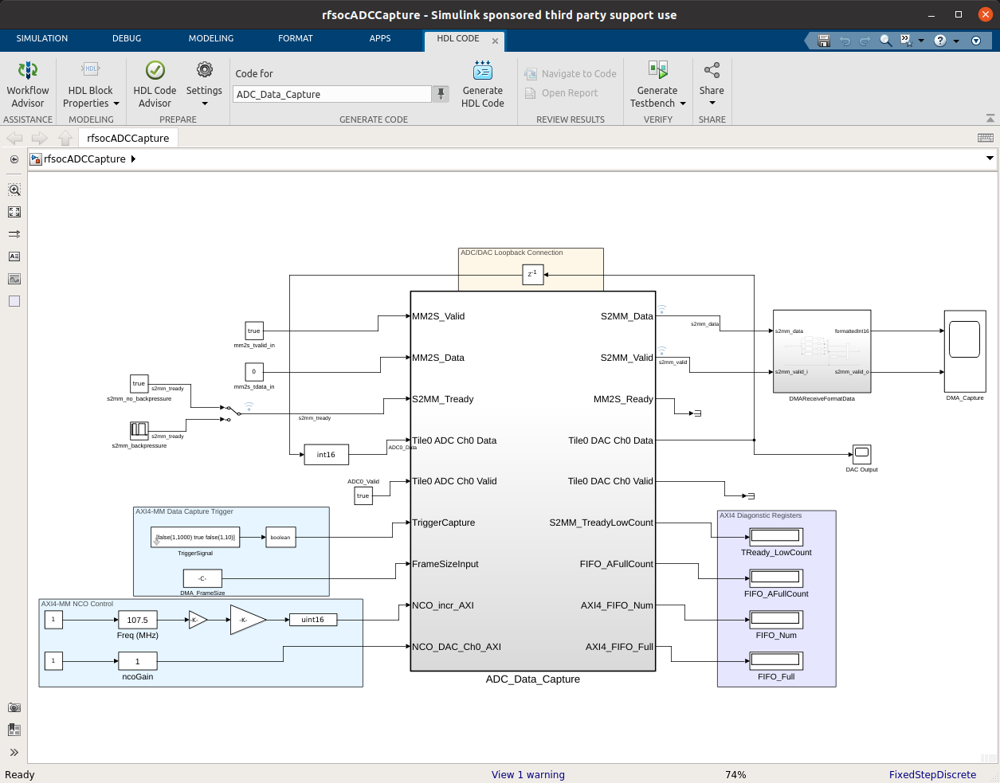

.. note:: On Linux or Windows you can **right click the top level design block** and choose the 'HDL Code --> Workflow Advisor' option from the menu!

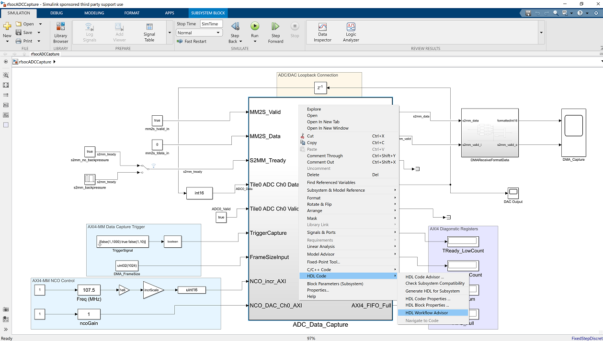

On some Linux installations, after Simulink opens, you may also select the HDL Coder tab and click the Workflow Advisor button:

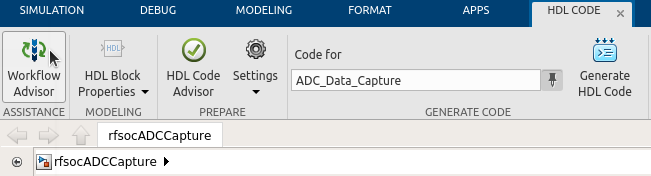

Wait for a little while and the following dialog should appear:

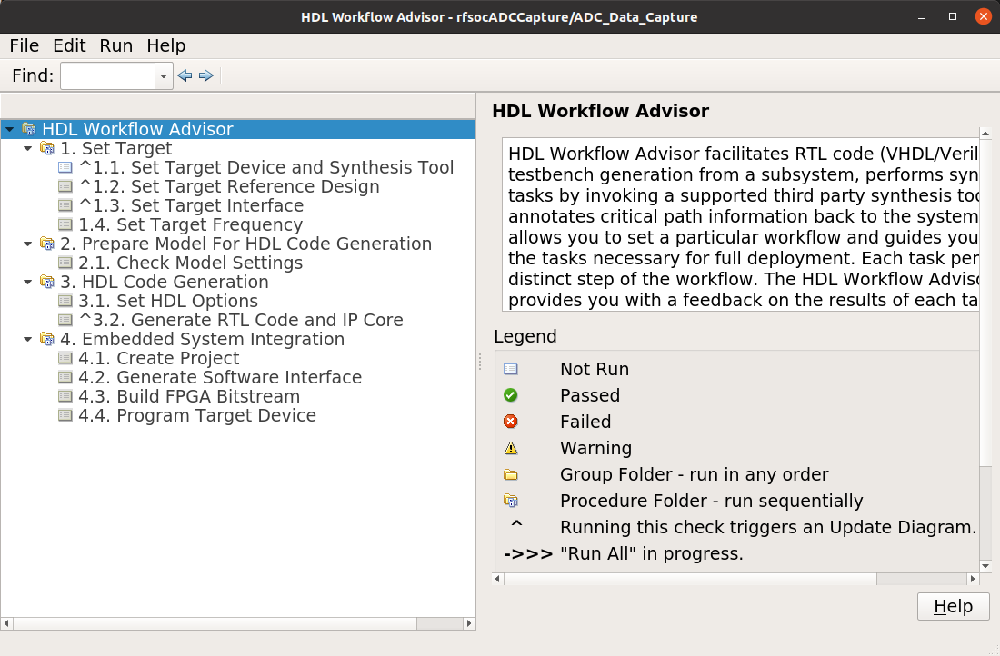

The HDL Coder Workflow Advisor is the bridge between the Simulink design and running the design on the hardware.
The advisor contains several presets and control setting options for the ZCU208.  The general workflow 
is to start with Step 1 and proceed step by step (and all the sub-steps) until the bitstream is built and
programmed to run on the hardware.  The final step will program the bitstream onto the ZCU208 development board
for you across the network.

As you go through each Workflow Advisor step you will see various option fields and pull down menus on the left,
these may be changed to customize the design.  The options here for example, allow for sample rates to be changed
and can be set to determine how the Simulink design is connected to which data converters.

To execute a Step you click on the **Run This Task button**.  If the Step executes successfully (as shown) a green check will
appear, if there was an error a red X will be shown:

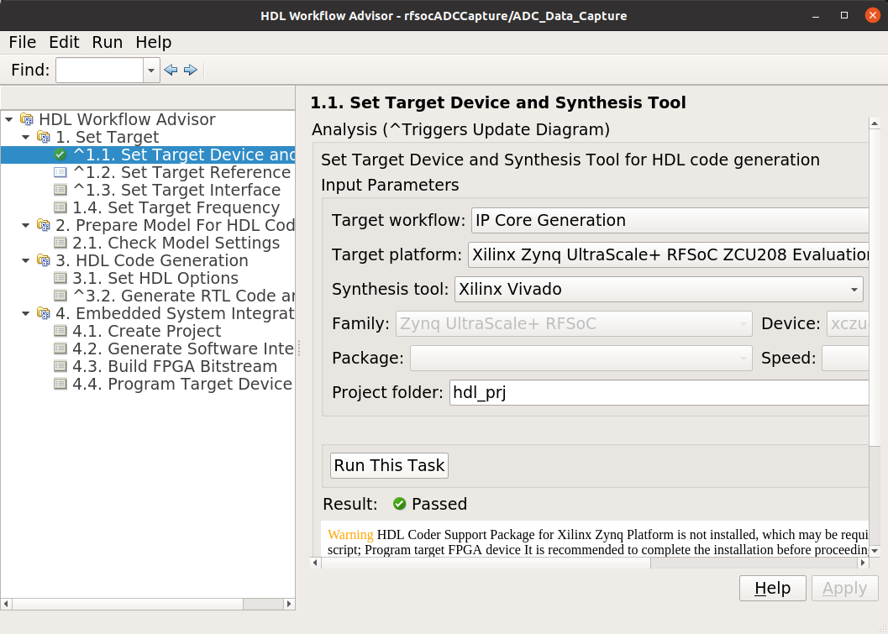

This shows some of the setting details for Step 1.2 - Set Target Reference Design:

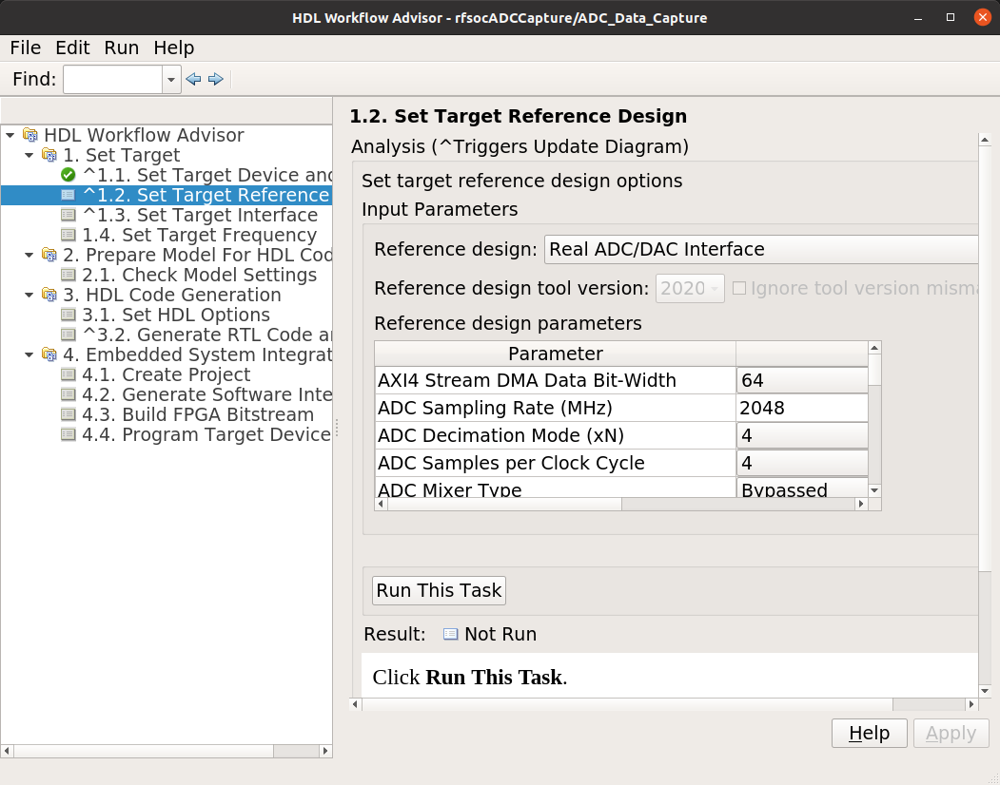

The project creation step is where the the Vivado project that contains the hardware design is generated.
By default it is created within the same directory as the .slx file under 'hdl_prj'.
After the Step 4.1 Project Creation completes you may use Vivado to open the .xpr and inspect the hardware
design if you like.

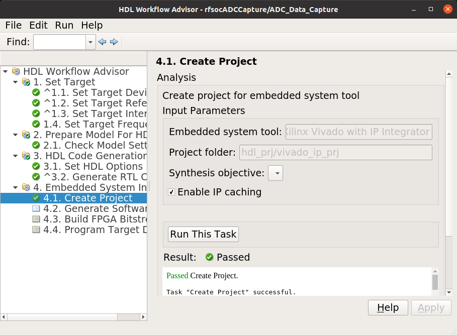

.. warning::
  You may right-click and select the "run-to" menu for any of the higher order steps rather than running through 
  each task one at a time. However do not do this for the last and final step (4.4) which programs the bitstream onto the ZCU208.
  You will need to wait for HDL Workflow Advisor to finish step (4.3) before selecting the next step.  Step (4.3) is where 
  Vivado creates the PL bitstream.  The bitstream file needs to exist before executing the next and final step to program it
  onto the ZCU208.  Step (4.3) can take a while to complete.

.. note::
  After the bitstream is programmed into the board, the board will software reboot.  It will take it a little time to reboot.
  You can use the ping command to determine when it is ready again.  After a little practice you will get a feel for how long the reboot takes.

You may follow a more detailed explanation here:  **Coming soon...**

.. note:: Learn more about MathWorks HDL Coder tools: `here <https://www.mathworks.com/products/hdl-coder.html>`_

----------------------------------
All included examples
----------------------------------

.. note::
  To rebuild any of the additional examples the same procedure can be followed as used for the ADC Capture demo above.

.. note::
  All examples are setup to use Tile 0 DAC 0 and Tile 0 ADC 0.  Except for MTS which is documented below.
  You may change these settings or any other settings to suit your own needs.

**examples/ADCDataCapture - ADC Capture**

Transmits a tone from Tile 0 DAC 0 and captures samples from Tile 0 ADC 0 into internal FPGA (PL) memory.

**examples/DDR4_ADCCapture - ADC Capture of CW tone**

Transmits a tone and captures live data and stores the samples in the PL DDR4 memory.

**examples/DDR4_DACWrite - DAC Output with DDR**

Outputs preloaded samples through Tile 0 DAC 0 which are read from external PL DDR4.

**examples/IQDataCapture - Capture I/Q samples**

Demonstrates capturing I/Q samples and transports them into MATLAB

**examples/Polyphase Channelizer - Polyphase Channelizer**

Demonstrates re-using the Simulink DSP toolbox polyphase channelizer IP block.  The signal is routed out Tile 0 DAC 0
and into Tile 0 ADC 0.

**examples/MTS - Multi Tile Sync**

Demonstrates multi-tile sync mode by comparing any pair of multiple channel ADC sample's phase alignment.
This demo outputs a CW tone from Tile 0 DAC 0 to any of the 8 ADC inputs of the ZCU208 board.
From a matlab script, any pair of ADC channels can selected to read samples back into MATLAB.
You will need to wire the RF signals that you chose to use appropriately.  Using the 1-4GHz baluns of
the XM655 and a dual RF splitter, the following wiring routed the signal into Tile 0 ADC 0 and Tile 1 ADC 1:

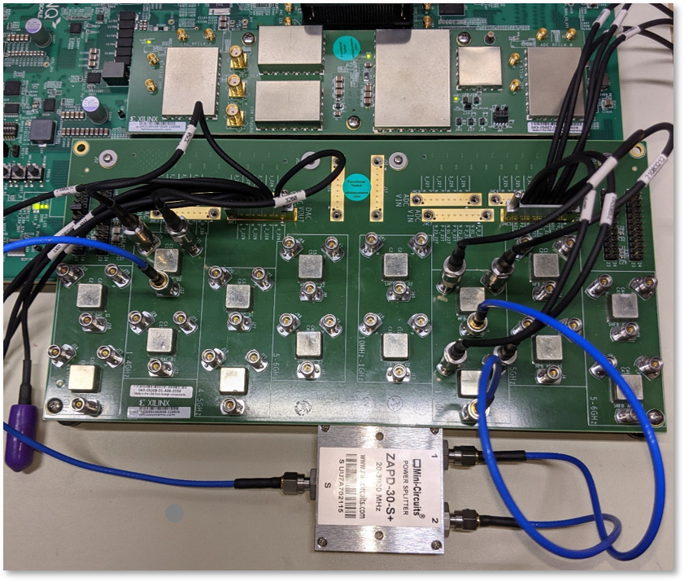

-------------------------------------
Support
-------------------------------------
For additional help or issues under the Discuss menu, please visit the **Ultrascale+ RFSoC Hardware section** on:

`Element 14 Website <https://community.element14.com/products/devtools/avnetboardscommunity/avnetboard-forums/f/rfsoc-hardware-design>`_

-------------------------------------
Known limitiations
-------------------------------------

1. The ADC and DAC tile clock inputs and distribution are hard wired.  They are setup to run off of the internal PLLs when not using MTS mode.
2. The number of AXI samples per clock, into or out of the data converter tiles must match for both the DACs and ADCs.
3. Using Fs over 7GHz on the DAC requires using IMR mode(s) but IMR mode for HDL Coder for ZCU208 does not work (fix in progress but no ETA)
4. The CLK104 board is setup for out of the box power up clocks.  There is no mechanism at the moment in HDL Coder to manage the CLK104 board.
5. For MTS mode to work best or at all in some cases, all system clocks should be a multiple of SYSREF which is set to 7.68MHz.  This is a Xilinx MTS behaviour.  There will be no warning if the clock rate does not meet this criteria, MTS in this context will quietly not align.
